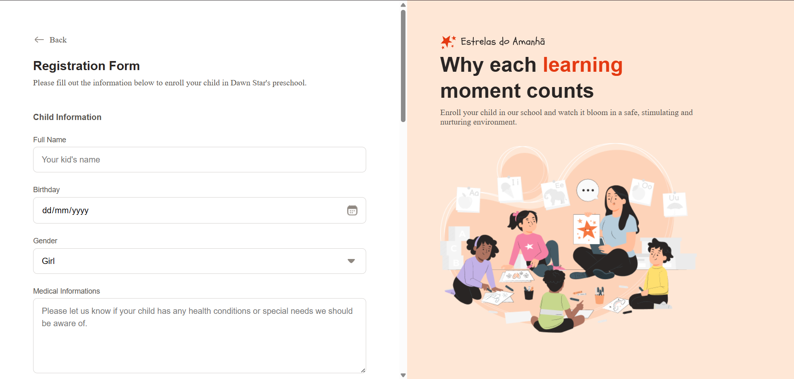

<h1 align=center>Dawn Stars Enroll Form</h1>

Project developed accordingly to Formação FullStack course's guidance.

 

    

## :rocket: Technologies

This project was developed with:

- HTML and CSS;
- Git and Github.

## :computer: Project

This project is about a enroll form for a kindergarden school named "Dawn Stars". Since I'm still a begginer, it's not exaclty funcional, as it doesn't have somewhere to archive the answers.

Here I have learned how to build a form using HTML. Also, I learned how to build a site with half of the screen static and the other scrollable, which I find pretty cool.
I'm looking forward to learn more complex coding as I progress in this course.

---

Made with ❤️ by Rocketseat :wave: [Participe da nossa comunidade!](https://discord.gg/rocketseat)
